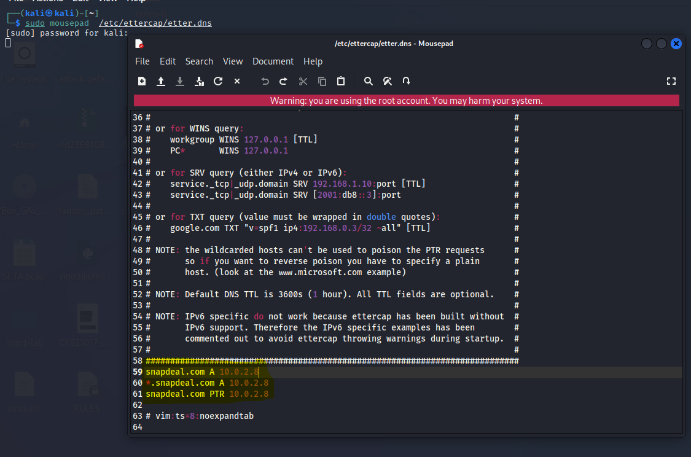
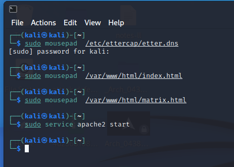
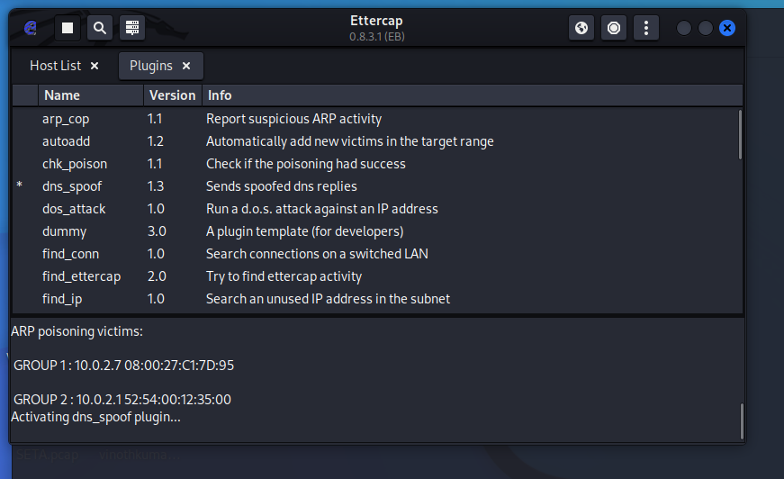

# 
 Insider Attacks 

Make use of Ettercap/arpspoof tool to perform ARP Cache Poisoning based attacks in a LAN environment.

For this lab have taken two ip address one as attacker and other as victim
- **10.0.2.7 is the victim** 

    

- **10.0.2.8 is the attacker**

    
  
  ARP (Address Resolution Protocol) is a network protocol used to map a IP address to a MAC address in a local network. It is used by network devices to send data to each other in the same network. When a network device needs to send data to another device in the same network, it first checks its ARP cache to see if it already has the physical address of the destination device. If the address is not in the cache, the device sends an ARP broadcast message to all devices in the network, asking for the physical address of the device with the specified network address. The device with the specified network address responds with its physical address, and the requesting device adds the information to its ARP cache for future use. The ARP cache is a table that maps network addresses to physical addresses, and it is used to speed up data transfer by eliminating the need for repeated ARP broadcasts.
  

      

---------------------- 
### Lets Perform Password stealing (over plaintext) using ARP Cache Poisoning attacks 

    
      

We are starting the Ettercap and giving the attacker and victims ip and starting the man in the middle attack and starting the arp poisoning then, we going to a website and using their login page. The website that I use here is "http://testphp.vulnweb.com/login.php" and I have entered the username and password and I got that in Ettercap also. Username as "**test**" and password as "**test**"

    
      
  
We have captured the packets and analyzed in the wireshark also.

    
  
--------------------
### Lets Perform DNS Spoofing attack using ARP Cache Poisoning attacks

First we have give the website name with our gateway in etter.dns using mousepad and then we should select which website page we are going to use. And then we have to start the apache server. The website here im giving is snapdeal.com

  

    

Then we have to start the Ettercap then give the attacker and victims ip and start the man in the middle attack with arp poisoning but here we have to start the dns in the plugin.
  

    
    

The dns attack is successfully executed.

And we have captured that in the the wireshark successfully.
  
